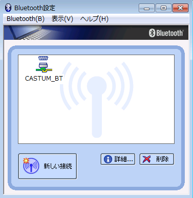

# NoPic

PIC serial monitor powered by Node.js

## 準備
- Node.jsインストール

 https://nodejs.org/en/download/ からPCに合ったものをダウンロードしてインストールします。

- Node.jsライブラリ

 NodeJSは様々なライブラリ(パッケージ)が配布されています。パッケージをインストールするには
npmというツールを使います。以下のパッケージが必要です。

- ws, seriaport, http-server

 各パッケージの説明は https://www.npmjs.com/ で探せます。

- パッケージのインストール

1. メニュー&rarr;Node.js&rarr;Node.js command prompt を選択
2. 以下を入力する
~~~
npm install ws
npm install serialport
npm install http-server
~~~
3. HOMEフォルダ以下にnode_modulesフォルダが作られていることを確認する。

## アプリのダウンロードと準備

1. ページの右の方の「Clone or download」ボタンを押して、ZIP形式でダウンロードする。または以下のURLからDL
-- https://github.com/KazukiHiraizumi/NoPic/archive/master.zip
2. PCで展開する
3. cdコマンドにて先のcommand promptを展開したフォルダに移動する。HOME以下に展開したとするとcommand promptから以下のコマンドを入力する。
~~~
cd %HOMEPATH%\NoPIC
~~~
4. Httpdの実行
~~~
node %HOMEPATH%\node_modules\http-server\bin\http-server
~~~
 セキュリティ警告が出た場合は、許可するを選択する。
 正常に起動できたら以下のメッセージが表示される
~~~
Starting up http-server, serving ./
Available on:
  http://127.0.0.1:8080
  http://192.168.99.9:8080
Hit CTRL-C to stop the server
~~~
## バックエンドの起動
 Bluetoothの準備ができたら、
~~~
node backend.js
~~~
 
接続されたかどうかは「Bluetooth設定」で確認する。「Bluetooth設定」の「接続」メニューは使わない方がよい。

## フロントエンドの起動
1. Webブラウザで http://localhost:8080/ に接続する。
2. command promptに
~~~
[server message] Connnected

~~~
と表示されたらOKです。

## 操作
1. RELOADボタン
 DCユニットのROMデータを読み込みます。
2. WRITEボタン
 変更した箇所を書き込みます。
